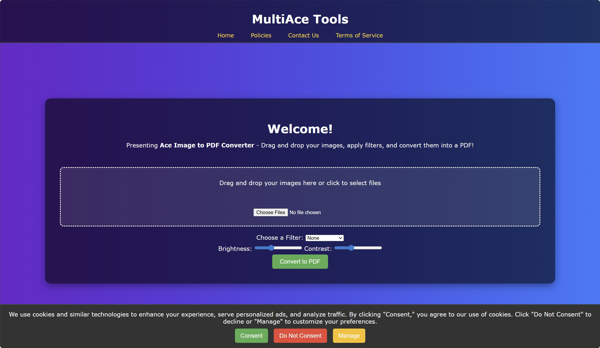

# 🧾 MultiAceTools Image to PDF Converter



🚀 **Live Demo:**  
https://multiacetools-image-to-pdf-converter.netlify.app/

---

## 📌 Overview

MultiAceTools Image to PDF Converter is an advanced browser-based web application that allows users to convert images into a single PDF file directly within the browser, without uploading files to any server.

The application includes built-in image enhancement tools such as brightness adjustment and visual filters, along with live preview functionality, enabling users to customize their images before generating the final PDF.

This project demonstrates my ability to build real-world, production-style frontend applications using modern JavaScript, focusing on performance, usability, and clean user experience.

---

## ✨ Key Features

- 📂 Upload and convert multiple images into PDF
- 🖼 Live image preview before conversion
- 🎛 Brightness adjustment support
- 🎨 Image filters for visual enhancement
- ⚡ Instant client-side PDF generation
- 🔒 100% browser-based (no server upload)
- 📱 Fully responsive design
- 🎯 Clean and user-friendly interface

---

## 🛠 Tech Stack

**Frontend:**

- HTML5  
- CSS3  
- JavaScript (Vanilla JS)

**Deployment:**

- Netlify

**Browser APIs Used:**

- DOM Manipulation  
- File Reader API  
- Canvas API  

---

## 🧠 Skills Demonstrated

This project highlights my ability to:

- Build real-world utility web applications
- Work with JavaScript file handling
- Implement image processing using Canvas
- Create responsive layouts
- Develop interactive UI features
- Deploy production-ready applications

---

## 📷 Screenshot


---

## 🌐 Live Website

https://multiacetools-image-to-pdf-converter.netlify.app/

---

## 📁 Repository Structure

```
multiacetools-image-to-pdf-converter
│
├── index.html
├── style.css
├── script.js
├── multiacetools-image-to-pdf-preview.png
├── README.md
├── LICENSE
└── .gitignore
```

---

## 🚀 Future Improvements

- Drag and drop image upload
- Image reordering before PDF generation
- More advanced filters
- PDF compression options
- React.js version

---

## 👨‍💻 Author

**Aditya Makhija**

🔗 GitHub:  
https://github.com/adityamakhija-dev

🔗 LinkedIn:  
https://www.linkedin.com/in/adityamakhija-dev

---

## 📄 License

This project is licensed under the MIT License — feel free to use and modify for learning purposes.

---

## ⭐ Support

If you found this project useful, please consider giving it a ⭐ on GitHub. It helps and motivates me to build more projects.
